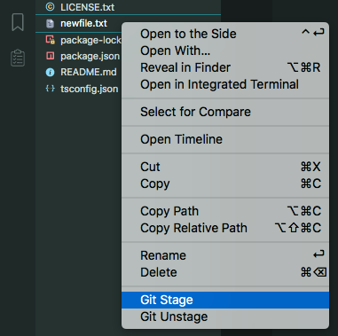
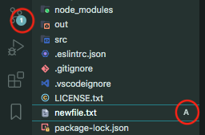
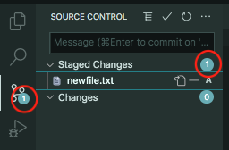

# Readme

This simple extension adds "Git Stage" and "Git Unstage" commands to vscode's file explorer context menu for adding new files to your Git repository right from the explorer. A possible alternative is typing "git add" which is not convenient for adding many files if they are located in different folders or if you are tired from typing "git add" and pasting a relative path. Staging all new files may not always work too because of other files in the project tree which you do not want to add but they are not listed in .gitignore

## Features

- Adds "Git Stage" and "Git Unstage" to the explorer context menu

Note: Both are safe to use multiple times or to be clicked for already tracked files - modifies index but not the working tree. I could not find a way to dynamically enable/disable context menu items in the file explorer.

### New menu items in the file explorer context menu

### File staged

## Release Notes

### 1.0.0

Initial release

## Contribution

This extension is my first one for vscode which I created when got a bit tired from typing "git add" once again :) Contributions are welcome!

---

**Enjoy!**
